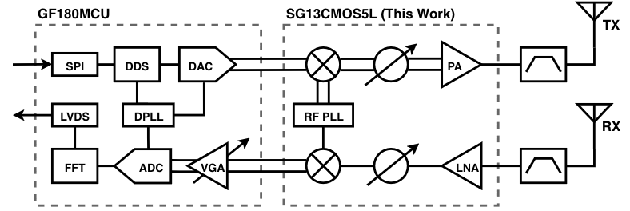

# RFFE4095 Datasheet

## 24 GHz Phased Array Radar RF Front End

**Revision:** 1.0.0  
**Date:** July 12th, 2026
**Author:** Max Vallone, Ryan Wans, Grant Congdon, Alek Taranov, Arthur Prudius, Andrew Fewell
**Technology:** IHP SG13G2 130 nm BiCMOS  

---

## 1. Features

Fully-integrated 22 - 26 GHz FMCW phased-array radar front end module with integrated LNA, PA, phase shifter, up/down conversion mixer, PLL, and VCO.

- **LNA**: LNA gain 22 dB, NF 3.5 dB @ 24 GHz. 
- **PA**: PA gain 25 dB, Pout +5 dBm over 22-26 GHz RF bandwidth.
- **Upconversion mixer**: Single sideband differential mixer with 3 dB conversion gain. 2 GHz IF bandwidth, 22-26 GHz RF bandwidth. 14 mA @ 1.8 V.
- **Downconversion mixer**: Single-ended mixer with 3 dB conversion gain, 2 GHz IF bandwidth, 22-26 GHz RF bandwidth. 3 mA @ 1.2 V.
- **Phase shifter**: 360° Gilbert cell topology phase shifter with polyphase input, single ended output, 40mA consumption at 1.2V.
- **PLL**: 26mA, 5.5-6.5G Quadrature Int-n PLL, 80MHz frequency steps, Off chip loop filter, 20MHz reference.
- **Multiplier**: x4 frequency multiplier with quadrature in, single ended out, 12mA.
- **VCO**: 6 GHz VCO with 5.276 GHz - 6.693 GHz (1.417 GHz tuning range), 0.65 Vpp swing, 89.66° I/Q at 1.65 V supply. 23.3 mA @ 1.65 V.
- **SPI**: SPI slave interface (CPOL=0, CPHA=0) for configurable frequency and operating point.

---

## 2. Block Diagram

---
